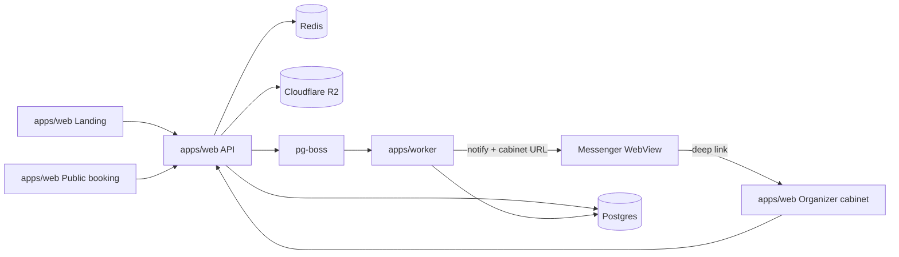

# Architecture

High-level system design for CountMeIn. Product domain lives in [domain.md](domain.md); decisions in [decisions/](decisions/).

## Product surfaces

| Surface           | App                         | Audience   | Responsibility                                                         |
| ----------------- | --------------------------- | ---------- | ---------------------------------------------------------------------- |
| Landing           | `apps/web`                  | Prospects  | Marketing, organizer sign-up                                           |
| Public booking    | `apps/web`                  | Guests     | `https://countmein.group/{orgSlug}` — service → slot → options → book  |
| Organizer cabinet | `apps/web`                  | Organizers | Services, slots, bookings, profile/media — opened from messenger links |
| API               | `apps/web` (Route Handlers) | Clients    | HTTP API; Auth.js for organizers                                       |
| Worker            | `apps/worker`               | —          | Messenger notifications / jobs                                         |

**MVP entry for organizers:** register via phone → OTP in messenger → later, each booking notification includes a link that opens the cabinet in the messenger WebView (or browser). No separate native app in MVP — [ADR-006](decisions/006-organizer-capacitor.md).

## Context diagram

## Component roles

| Component                                               | Role                                                                          |
| ------------------------------------------------------- | ----------------------------------------------------------------------------- |
| `apps/web`                                              | Next.js: landing, public booking, organizer cabinet, HTTP API, Auth.js        |
| `apps/worker`                                           | Jobs: messenger notifications with cabinet deep links (Telegram first)        |
| `packages/db`                                           | Drizzle schema, migrations, client                                            |
| `packages/api-contracts`                                | Zod schemas shared by web and worker                                          |
| `packages/storage`                                      | R2 signed upload helpers                                                      |
| `packages/eslint-config` / `packages/typescript-config` | Shared lint & TS configs                                                      |
| Postgres                                                | Domain + `pg-boss`                                                            |
| Redis                                                   | Sessions, OTP TTL, rate limits                                                |
| Cloudflare R2                                           | Organizer avatar + service images ([ADR-007](decisions/007-cloudflare-r2.md)) |

## Critical flow: create booking (guest)

1. `GET` public page data by organizer `slug` (services, slots; cacheable).
2. Guest picks service/slot/options; enters name + phone; messenger OTP verifies phone (Redis TTL; **no seat held**).
3. `POST` booking in one transaction (after OTP):
   - validate `selectedOptions` against service
   - **claim seats atomically** with one conditional statement: `UPDATE TimeSlot SET bookedCount = bookedCount + :seats WHERE id = :id AND bookedCount + :seats <= capacity RETURNING …` (not a read-then-write — that reopens the overbooking race)
   - if no row was updated, the slot is full → abort
   - insert `Booking` (`confirmed`)
4. Enqueue `booking.created` (booking **management link** for guest; **cabinet URL** for organizer).
5. Worker notifies guest + organizer; organizer message includes link to cabinet / booking.
6. Invalidate TanStack Query on the public page (and cabinet if open).

If the slot filled during OTP, the conditional `UPDATE` in step 3 affects no row and the booking is aborted; guest picks another slot. No `pending` status.

### Cancel (MVP)

Guests manage a booking on a dedicated **booking management page**, reachable two ways:

- **Deep link** in the messenger notification (`https://countmein.group/b/{manageToken}`) — the messenger already proved phone ownership, so no extra OTP is required.
- **Phone + OTP lookup:** guest enters their phone, receives a messenger OTP, and sees the bookings for that phone.

The page shows the booking details and a **Cancel** button. Organizers can also cancel from the web cabinet. Cancelling runs one transaction: set `cancelled` + decrement `bookedCount` + enqueue `booking.cancelled`.

### Media upload (organizer)

Authenticated organizer in cabinet → signed upload URL → PUT to R2 → save URL on `photoUrl`.

## Auth boundary

- **Organizers:** Auth.js (phone + messenger OTP); session for cabinet routes. Deep links should land in an authenticated session (cookie after login, or one-time link that establishes session). See [ADR-005](decisions/005-phone-messenger.md).
- **Visitors:** No Auth.js account; booking management via messenger deep link (`manageToken`) or phone + OTP lookup. See [ADR-002](decisions/002-guest-booking.md).

## Monorepo

[ADR-001](decisions/001-monorepo-layout.md) · organizer client [ADR-006](decisions/006-organizer-capacitor.md) · storage [ADR-007](decisions/007-cloudflare-r2.md).

## Jobs / notifications

`pg-boss` + `apps/worker`; messengers primary ([ADR-005](decisions/005-phone-messenger.md), [ADR-004](decisions/004-queue-pg-boss.md)).

## Out of scope for this document

- Concrete DDL (Drizzle later).
- Deployment topology and CI details.
- Payment processing, multi-staff, subdomain tenancy, Capacitor app ([roadmap.md](roadmap.md)).
