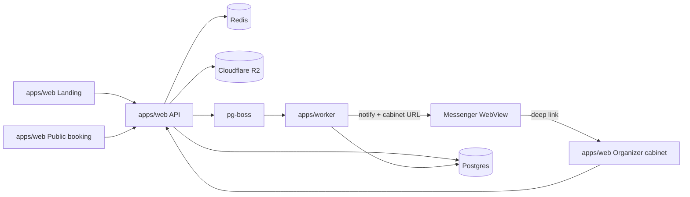

# Architecture

High-level system design for CountMeIn. Product domain in [domain.md](domain.md); decisions in [decisions/](decisions/).

## Product surfaces

| Surface           | App                         | Audience   | Responsibility                                                   |
| ----------------- | --------------------------- | ---------- | ---------------------------------------------------------------- |
| Landing           | `apps/web`                  | Prospects  | Marketing, organizer sign-up                                     |
| Public booking    | `apps/web`                  | Guests     | `https://countmein.group/{orgSlug}` — service → slot → book      |
| Organizer cabinet | `apps/web`                  | Organizers | Services, slots, bookings, profile — opened from messenger links |
| API               | `apps/web` (Route Handlers) | Clients    | HTTP API; Auth.js for organizers                                 |
| Worker            | `apps/worker`               | —          | Messenger notifications / jobs                                   |

**MVP entry for organizers:** register via Telegram Login Widget → profile form → booking notifications include cabinet deep link. No native app — [ADR-006](decisions/006-organizer-capacitor.md).

## Context diagram



## Component roles

| Component                                      | Role                                                                          |
| ---------------------------------------------- | ----------------------------------------------------------------------------- |
| `apps/web`                                     | Next.js: landing, public booking, cabinet, API, Auth.js                       |
| `apps/worker`                                  | Jobs: messenger notifications with cabinet deep links (Telegram first)        |
| `packages/db`                                  | Drizzle schema, migrations, client                                            |
| `packages/redis`                               | ioredis singleton (sessions, auth tickets, rate limits)                       |
| `packages/contracts`                           | Zod schemas shared by web and worker                                          |
| `packages/media-storage`                       | R2 signed upload helpers                                                      |
| `packages/eslint-config` / `typescript-config` | Shared lint & TS configs                                                      |
| Postgres                                       | Domain + `pg-boss`                                                            |
| Redis                                          | Sessions, short-lived auth tickets, rate limits                               |
| Cloudflare R2                                  | Organizer avatar + service images ([ADR-007](decisions/007-cloudflare-r2.md)) |

## Critical flow: create booking (guest)

1. `GET` public page data by organizer `slug` (services, slots; cacheable).
2. Guest picks service/slot/options; enters name; authenticates with messenger login widget — server validates signed payload and issues short-lived guest ticket (Redis TTL; **no seat held**).
3. `POST` booking in one transaction (with the ticket):
   - validate `selectedOptions` against service
   - **claim seats atomically**: `UPDATE TimeSlot SET bookedCount = bookedCount + :seats WHERE id = :id AND bookedCount + :seats <= capacity RETURNING …` (not read-then-write)
   - if no row updated → slot full → abort
   - insert `Booking` (`confirmed`)
4. Enqueue `booking.created` (management link for guest; cabinet URL for organizer).
5. Worker notifies guest + organizer.
6. Invalidate TanStack Query on public page (and cabinet if open).

If slot filled while authenticating, conditional `UPDATE` affects no row → abort. No `pending` status.

### Cancel (MVP)

Guests cancel on `/booking/{manageToken}` (deep link from messenger) or re-authenticate for booking lookup. Organizers cancel from cabinet. One transaction: set `cancelled` + decrement `bookedCount` + enqueue `booking.cancelled`.

### Media upload (organizer)

Authenticated organizer → signed upload URL → PUT to R2 → save URL on `photoUrl`.

## Auth boundary

- **Organizers:** Auth.js (Telegram Login Widget, server-side HMAC); session for cabinet. Notification deep links use **one-time login link**: worker stores `{ organizerId, next }` in Redis under 32-byte token → `/login/link/{token}` consumed via `POST` (server action calling `signIn`). `GET` does not consume — link previewers fetch URLs before human clicks. Single-use, 30-day TTL, `noindex`, demo id refused; failure → `/login`. See [ADR-008](decisions/008-messenger-only-auth.md).
- **Visitors:** No Auth.js account; booking requires widget auth (short-lived ticket); management via deep link or re-auth. See [ADR-002](decisions/002-guest-booking.md).

## Jobs / notifications

`pg-boss` + `apps/worker`; messengers primary ([ADR-008](decisions/008-messenger-only-auth.md), [ADR-004](decisions/004-queue-pg-boss.md)).

### Queues

| Queue               | Payload                      | Jobs per event                          |
| ------------------- | ---------------------------- | --------------------------------------- |
| `booking.created`   | `{ bookingId, recipient }`   | **Two** — one per recipient             |
| `booking.cancelled` | `{ bookingId, cancelledBy }` | One — counterparty only                 |
| `demo.refresh`      | —                            | Scheduled daily (`seedDemo()`, ADR-010) |

**One job per recipient** — a retry re-sends only to whoever failed. **Payloads carry ids only** — worker refetches at send time, so `manageToken` and login tokens never reach `pgboss.job`. Contracts in `packages/contracts/src/jobs.ts`.

**Enqueue inside the booking transaction** (`apps/web/src/server/queue.ts`, pg-boss `fromDrizzle` over caller's `tx`). Web instance is send-only; maintenance/cron belong to the single worker.

### Links in messages

| Message                        | Button target                                                           |
| ------------------------------ | ----------------------------------------------------------------------- |
| Organizer — new / cancelled    | `/login/link/{token}` → session → `/cabinet/bookings?slot={timeSlotId}` |
| Guest — confirmed              | `/booking/{manageToken}`                                                |
| Guest — cancelled by organizer | `/{orgSlug}` (rebook)                                                   |

### Delivery policy

Telegram bot can only message users who pressed **Start** — UX includes bot-start step after widget auth, with management deep link shown on-screen as fallback.

| Telegram response           | Action                                        |
| --------------------------- | --------------------------------------------- |
| `403`, `400 chat not found` | Complete job and log — no retry can succeed   |
| `429`, `5xx`, network       | Throw → pg-boss retries (5 attempts, backoff) |
| Other `4xx`                 | Fail loudly — our bug                         |

Worker refuses demo organizer in every handler (`isDemoOrganizerId`).

### Running locally

`bun run dev` starts **both** `web` and `worker`. Enqueue is transactional — booking with no worker still succeeds, jobs sit in `pgboss.job` as `created` until one starts. Check for running worker before suspecting send path:

```sql
select name, data->>'recipient' as recipient, state, retry_count
from pgboss.job order by created_on desc limit 10;
```

`created` = nothing consumed it. `failed` / non-zero `retry_count` = send failing; `output` column holds error.

Both processes read repo-root `.env` — worker via `--env-file=../../.env`.

## Observability

Two tools, one job each — Sentry for errors and performance, PostHog for product analytics and behaviour.

| Tool        | Scope                                                                        | Where it runs                                                                                                    |
| ----------- | ---------------------------------------------------------------------------- | ---------------------------------------------------------------------------------------------------------------- |
| **Sentry**  | Unhandled exceptions, crash reports, performance traces, source-map upload   | `apps/web` (client + server via `instrumentation.ts` + `sentry.client.config.ts`), `apps/worker` (`@sentry/bun`) |
| **PostHog** | Page views, funnels, feature flags, session replay, notification-sent events | `apps/web` (browser via `lib/posthog.ts`), `apps/worker` (`posthog-node` for server events)                      |

### Sentry

- **Server init:** [`apps/web/src/instrumentation.ts`](../apps/web/src/instrumentation.ts) — `src/`-root Next.js convention (like `proxy.ts`); do not move. No-op without `SENTRY_DSN`.
- **Client init:** [`apps/web/sentry.client.config.ts`](../apps/web/sentry.client.config.ts) — loaded automatically by `@sentry/nextjs` in the browser bundle.
- **Error boundaries:** [`apps/web/src/app/error.tsx`](../apps/web/src/app/error.tsx) and [`apps/web/src/app/global-error.tsx`](../apps/web/src/app/global-error.tsx) call `Sentry.captureException`. The global boundary catches root-layout errors the regular boundary cannot.
- **Worker:** [`apps/worker/src/index.ts`](../apps/worker/src/index.ts) inits `@sentry/bun` and captures in `runHandler` (both retriable and unretriable failures) and `boss.on('error')`.
- **Source maps:** `withSentryConfig` in [`apps/web/next.config.js`](../apps/web/next.config.js) uploads source maps during CI builds when `SENTRY_AUTH_TOKEN` is set.
- **Replay is off** — PostHog session replay covers the "what did the user do" question; enabling Sentry replay too would double the client payload cost.

### PostHog

- **Browser client:** [`apps/web/src/lib/posthog.ts`](../apps/web/src/lib/posthog.ts) — lazy singleton, initialised from [`apps/web/src/app/providers.tsx`](../apps/web/src/app/providers.tsx). Autocaptures page views; session replay masks all inputs (no PII).
- **User identification:** signed-in organizers are identified by `Organizer.id`. Guests stay anonymous — their messenger identity is PII that does not belong in analytics.
- **Worker events:** [`apps/worker/src/posthog.ts`](../apps/worker/src/posthog.ts) exposes a `posthog-node` client. Job handlers emit `notification_sent` with `{ queue, recipient, bookingId }` after a successful send. Flushed on shutdown.
- **PostHog Cloud** — `NEXT_PUBLIC_POSTHOG_HOST` defaults to `https://app.posthog.com`.

### No-op without keys

Both SDKs check their env var before initialising, so local dev and CI run without accounts and tests are unaffected.

## Out of scope

- Concrete DDL (Drizzle later).
- Deployment topology and CI.
- Payments, multi-staff, subdomain tenancy, Capacitor app ([roadmap.md](roadmap.md)).
