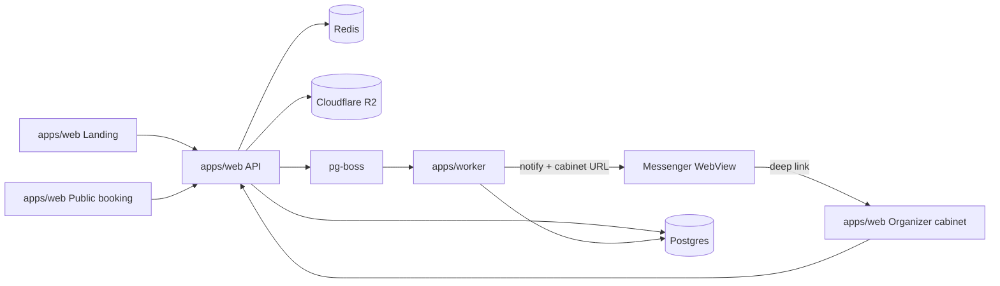

# Architecture

High-level system design for CountMeIn. Product domain lives in [domain.md](domain.md); decisions in [decisions/](decisions/).

## Product surfaces

| Surface           | App                         | Audience   | Responsibility                                                                                    |
| ----------------- | --------------------------- | ---------- | ------------------------------------------------------------------------------------------------- |
| Landing           | `apps/web`                  | Prospects  | Marketing, organizer sign-up                                                                      |
| Public booking    | `apps/web`                  | Guests     | `https://countmein.group/{orgSlug}` — service → slot → options → book (slug min 4 chars, ADR-009) |
| Organizer cabinet | `apps/web`                  | Organizers | Services, slots, bookings, profile/media — opened from messenger links                            |
| API               | `apps/web` (Route Handlers) | Clients    | HTTP API; Auth.js for organizers                                                                  |
| Worker            | `apps/worker`               | —          | Messenger notifications / jobs                                                                    |

**MVP entry for organizers:** register via messenger login (Telegram Login Widget) → profile form → later, each booking notification includes a link that opens the cabinet in the messenger WebView (or browser). No separate native app in MVP — [ADR-006](decisions/006-organizer-capacitor.md).

## Context diagram



## Component roles

| Component                                               | Role                                                                          |
| ------------------------------------------------------- | ----------------------------------------------------------------------------- |
| `apps/web`                                              | Next.js: landing, public booking, organizer cabinet, HTTP API, Auth.js        |
| `apps/worker`                                           | Jobs: messenger notifications with cabinet deep links (Telegram first)        |
| `packages/db`                                           | Drizzle schema, migrations, client                                            |
| `packages/redis`                                        | ioredis singleton shared by web and worker                                    |
| `packages/api-contracts`                                | Zod schemas shared by web and worker                                          |
| `packages/storage`                                      | R2 signed upload helpers                                                      |
| `packages/eslint-config` / `packages/typescript-config` | Shared lint & TS configs                                                      |
| Postgres                                                | Domain + `pg-boss`                                                            |
| Redis                                                   | Sessions, short-lived auth tickets, rate limits                               |
| Cloudflare R2                                           | Organizer avatar + service images ([ADR-007](decisions/007-cloudflare-r2.md)) |

## Critical flow: create booking (guest)

1. `GET` public page data by organizer `slug` (services, slots; cacheable).
2. Guest picks service/slot/options; enters name; authenticates with the messenger login widget — the server validates the signed payload and issues a short-lived guest ticket (Redis TTL; **no seat held**).
3. `POST` booking in one transaction (with the ticket):
   - validate `selectedOptions` against service
   - **claim seats atomically** with one conditional statement: `UPDATE TimeSlot SET bookedCount = bookedCount + :seats WHERE id = :id AND bookedCount + :seats <= capacity RETURNING …` (not a read-then-write — that reopens the overbooking race)
   - if no row was updated, the slot is full → abort
   - insert `Booking` (`confirmed`)
4. Enqueue `booking.created` (booking **management link** for guest; **cabinet URL** for organizer).
5. Worker notifies guest + organizer; organizer message includes link to cabinet / booking.
6. Invalidate TanStack Query on the public page (and cabinet if open).

If the slot filled while the guest was authenticating, the conditional `UPDATE` in step 3 affects no row and the booking is aborted; guest picks another slot. No `pending` status.

### Cancel (MVP)

Guests manage a booking on a dedicated **booking management page**, reachable two ways:

- **Deep link** in the messenger notification (`https://countmein.group/booking/{manageToken}`) — delivered to the guest's verified messenger account, which is itself proof of ownership.
- **Messenger lookup:** guest re-authenticates with the login widget and sees the bookings for that messenger account (`guestMessenger` + `guestMessengerId`).

The page shows the booking details and a **Cancel** button. Organizers can also cancel from the web cabinet. Cancelling runs one transaction: set `cancelled` + decrement `bookedCount` + enqueue `booking.cancelled`.

### Media upload (organizer)

Authenticated organizer in cabinet → signed upload URL → PUT to R2 → save URL on `photoUrl`.

## Auth boundary

- **Organizers:** Auth.js (messenger login — Telegram Login Widget, server-side HMAC validation); session for cabinet routes. Notification deep links land in an authenticated session via a **one-time login link**: the worker stores `{ organizerId, next }` in Redis under a 32-byte token and links to `/login/link/{token}`; the page consumes it through a `POST` (a server action calling `signIn`) and redirects. `GET` deliberately does not consume — link previewers and scanners fetch URLs before a human clicks. Single-use, 30-day TTL, `noindex`, demo id refused; any failure redirects to `/login`. See [ADR-008](decisions/008-messenger-only-auth.md).
- **Visitors:** No Auth.js account; booking requires widget auth (short-lived guest ticket); management via messenger deep link (`manageToken`) or re-auth lookup. See [ADR-002](decisions/002-guest-booking.md).

## Monorepo

[ADR-001](decisions/001-monorepo-layout.md) · organizer client [ADR-006](decisions/006-organizer-capacitor.md) · storage [ADR-007](decisions/007-cloudflare-r2.md).

## Jobs / notifications

`pg-boss` + `apps/worker`; messengers primary, addressed by messenger user id ([ADR-008](decisions/008-messenger-only-auth.md), [ADR-004](decisions/004-queue-pg-boss.md)).

### Queues

| Queue               | Payload                      | Jobs per event                                                     |
| ------------------- | ---------------------------- | ------------------------------------------------------------------ |
| `booking.created`   | `{ bookingId, recipient }`   | **Two** — one for the organizer, one for the guest                 |
| `booking.cancelled` | `{ bookingId, cancelledBy }` | One — the counterparty; the actor already saw the result on screen |
| `demo.refresh`      | —                            | Scheduled daily (`seedDemo()`, ADR-010)                            |

**One job per recipient, not one job per event.** The most common delivery
failure is a recipient who never pressed Start on the bot; with a combined
handler every retry would re-send to the party that _did_ receive it. Splitting
the jobs makes a retry re-send only to whoever failed.

**Payloads carry ids only.** The worker refetches Booking → TimeSlot → Service →
Organizer at send time, so a job delayed by a retry renders current state, and
neither `manageToken` nor a login token is ever written to the `pgboss.job`
table. Contracts live in `packages/api-contracts/src/jobs.ts`.

**Enqueue happens inside the booking transaction** (`apps/web/lib/server/queue.ts`,
pg-boss's `fromDrizzle` adapter over the caller's `tx`). Published after the
commit a job can be lost; published before it on its own connection it can fire
for a booking that rolls back. The web instance is send-only — `supervise` and
`schedule` are off, so maintenance and cron belong to the single worker.

### Links in messages

Each message carries one inline-keyboard button:

| Message                        | Button target                                                           |
| ------------------------------ | ----------------------------------------------------------------------- |
| Organizer — new / cancelled    | `/login/link/{token}` → session → `/cabinet/bookings?slot={timeSlotId}` |
| Guest — confirmed              | `/booking/{manageToken}`                                                |
| Guest — cancelled by organizer | `/{orgSlug}` (rebook; the booking is dead, so no management link)       |

Organizer links are **one-time login links** because `/cabinet` needs no session:
without one the organizer would land in the read-only demo cabinet (ADR-010).
The worker mints a token per send attempt into Redis (30-day TTL, payload
`{ organizerId, next }`); `apps/web` consumes it at `/login/link/{token}`. See
the Auth boundary section.

### Delivery policy

Constraint: a Telegram bot can only message users who pressed **Start** — the UX
includes a bot-start step after widget auth, with the management deep link shown
on-screen as fallback.

| Telegram response           | Action                                           |
| --------------------------- | ------------------------------------------------ |
| `403`, `400 chat not found` | Complete the job and log — no retry can succeed  |
| `429`, `5xx`, network       | Throw → pg-boss retries (5 attempts, backoff)    |
| Other `4xx`                 | Fail loudly — our bug (bad markup or button URL) |

The worker refuses the demo organizer in every handler (`isDemoOrganizerId`),
even though write paths already reject demo bookings before enqueueing.

### Running it locally

`bun run dev` at the repo root starts **both** `web` and `worker`; the worker is
not optional in development. Because the enqueue is transactional, a booking
made with no worker running still succeeds — its jobs simply sit in `pgboss.job`
as `created` until one starts, and are delivered then. That is at-least-once
behaving correctly, but the symptom is "the booking worked and no message
arrived", so check for a running worker before suspecting the send path:

```sql
select name, data->>'recipient' as recipient, state, retry_count
from pgboss.job order by created_on desc limit 10;
```

`created` = nothing consumed it (no worker). `failed` / non-zero `retry_count` =
the send itself is failing; the `output` column holds the error.

Both processes read the repo-root `.env` — the worker via `--env-file=../../.env`
in its `dev` / `start` scripts, since it has no framework to load it.

## Out of scope for this document

- Concrete DDL (Drizzle later).
- Deployment topology and CI details.
- Payment processing, multi-staff, subdomain tenancy, Capacitor app ([roadmap.md](roadmap.md)).
