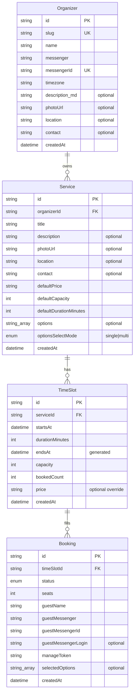

# Domain model

Core entities and invariants for CountMeIn booking. Architecture: [architecture.md](architecture.md).

There is **no `Calendar` entity**. Organizer owns services directly; timezone lives on the organizer (one working timezone per organizer).

## Entities

Organizer reaches bookings **transitively** (`Organizer → Service → TimeSlot → Booking`); no direct `Booking.organizerId` (invariant 5).

### Identifiers and public URLs

| Entity      | PK type                        | Exposed in URL?                         |
| ----------- | ------------------------------ | --------------------------------------- |
| `Organizer` | `uuid` (Auth.js user id)       | No — public page uses `slug`            |
| `Service`   | short `text` id (nanoid/cuid2) | Yes                                     |
| `TimeSlot`  | `uuid`                         | No                                      |
| `Booking`   | `uuid`                         | No — management page uses `manageToken` |

- Organizer: `https://countmein.group/{orgSlug}`
- Service: `https://countmein.group/{orgSlug}/{serviceId}`
- Booking management: `https://countmein.group/booking/{manageToken}`

`Organizer.id` is `uuid` for Auth.js integration, never shown; slug is the human-friendly address. `Service.id` is short random `text` for clean URLs.

### Organizer

Auth.js account (`id` is sole PK). Login identity is messenger account ([ADR-008](decisions/008-messenger-only-auth.md)) — **no phone column**.

| Field         | Required | Meaning                                                  |
| ------------- | -------- | -------------------------------------------------------- |
| `id`          | yes      | PK; Auth.js user id                                      |
| `slug`        | yes      | Public URL segment                                       |
| `name`        | yes      | Display name                                             |
| `messenger`   | yes      | Auth/notification channel (`telegram` in MVP)            |
| `messengerId` | yes      | Stable messenger user id; unique with `messenger`        |
| `timezone`    | yes      | IANA tz (e.g. `Europe/Belgrade`); all slots in this zone |
| `description` | no       | Markdown for public page                                 |
| `photoUrl`    | no       | Avatar (object storage)                                  |
| `location`    | no       | Display address; default for services                    |
| `contact`     | no       | Display "how to reach me"; default for services          |
| `createdAt`   | yes      | UTC timestamp                                            |

MVP: one organizer = one person. Multi-staff post-MVP.

### Service

Bookable offering owned by an organizer.

| Field                    | Required           | Meaning                                                   |
| ------------------------ | ------------------ | --------------------------------------------------------- |
| `organizerId`            | yes                | FK → Organizer                                            |
| `title`                  | yes                | Name                                                      |
| `description`            | no                 | Longer text                                               |
| `photoUrl`               | no                 | Service image                                             |
| `location`               | no                 | Overrides `Organizer.location` when set                   |
| `contact`                | no                 | Overrides `Organizer.contact` when set                    |
| `defaultPrice`           | yes                | **Display text** (e.g. `1500 UAH`) — not a payment amount |
| `defaultCapacity`        | yes                | Template for new slots                                    |
| `defaultDurationMinutes` | yes                | Template for new slots (minutes; `> 0`)                   |
| `options`                | no                 | Variation labels as plain strings (`text[]`)              |
| `optionsSelectMode`      | when `options` set | `single` or `multi`                                       |
| `createdAt`              | yes                | UTC timestamp                                             |

`options` are plain strings (not separate entity). `Booking.selectedOptions` stores chosen **string values** — booking keeps exact labels even if organizer edits options later.

### Contact (display field)

`contact` is one universal string on both `Organizer` and `Service`. Effective value: `service.contact ?? organizer.contact ?? null`. No auth/notification role. Rendered via `detectContactKind` (phone/email/URL/plain) + `<ContactLink />`.

### TimeSlot

Concrete occurrence of a service.

| Field             | Required | Meaning                                                                 |
| ----------------- | -------- | ----------------------------------------------------------------------- |
| `serviceId`       | yes      | FK → Service                                                            |
| `startsAt`        | yes      | `timestamptz` (UTC; displayed in organizer's timezone)                  |
| `durationMinutes` | yes      | Whole minutes; `> 0`. Seeded from `Service.defaultDurationMinutes`      |
| `endsAt`          | derived  | **Generated** column = `startsAt + durationMinutes` (for range queries) |
| `capacity`        | yes      | Max seats                                                               |
| `bookedCount`     | yes      | Seats held by `confirmed` bookings                                      |
| `price`           | no       | Display-text override; null → use `Service.defaultPrice`                |
| `createdAt`       | yes      | UTC timestamp                                                           |

Interval: half-open `[startsAt, endsAt)`. `durationMinutes` is source of truth; `endsAt` is derived, indexable column.

### Booking

Reservation on a slot by a guest (no Auth.js account). Guest identified by messenger account, verified via login widget at booking time ([ADR-002](decisions/002-guest-booking.md), [ADR-008](decisions/008-messenger-only-auth.md)).

| Field                 | Required | Meaning                                                                          |
| --------------------- | -------- | -------------------------------------------------------------------------------- |
| `timeSlotId`          | yes      | FK → TimeSlot                                                                    |
| `seats`               | yes      | `>= 1`                                                                           |
| `guestName`           | yes      | Display name                                                                     |
| `guestMessenger`      | yes      | Messenger enum (`telegram` in MVP)                                               |
| `guestMessengerId`    | yes      | Stable messenger user id; indexed with `guestMessenger` for "my bookings"        |
| `guestMessengerLogin` | no       | Human-readable handle (e.g. @username)                                           |
| `manageToken`         | yes      | Opaque secret in messenger deep link; **stored verbatim** (not hashed yet — MVP) |
| `selectedOptions`     | no       | String values from `Service.options` (`text[]`; null when no options)            |
| `status`              | yes      | Lifecycle                                                                        |
| `createdAt`           | yes      | UTC timestamp                                                                    |

Validation: every `selectedOptions` entry must be in service's `options`; count respects `optionsSelectMode`.

**`manageToken` not hashed yet** — stored verbatim for direct match on `bookings_manage_token_key`. Treated as password-equivalent: never in URL on cancel (request body), never in `BookingRecord`, `/booking/{manageToken}` is `noindex`.

## Booking statuses

| Status      | Meaning                                  |
| ----------- | ---------------------------------------- |
| `confirmed` | Active; counts toward `bookedCount`      |
| `cancelled` | Released; must not count toward capacity |

MVP flow: guest authenticates **before** booking row exists (short-lived ticket; no seat held); one transaction claims seats and inserts `confirmed`. **No `pending` status.** Cancel in MVP — guest via deep link or re-auth; organizer from cabinet.

## Invariants

1. **Capacity:** for every slot, sum of `seats` over `confirmed` bookings equals `bookedCount`, and `bookedCount <= capacity`.
2. **Atomic reserve:** seats claimed with **single conditional statement** — `UPDATE TimeSlot SET bookedCount = bookedCount + :seats WHERE id = :id AND bookedCount + :seats <= capacity RETURNING …` — inside booking transaction. `Booking` inserted only if statement affected a row. Never read `bookedCount`, check in JS, then write back.
3. **Public access:** visitors read/book only via organizer `slug`; no organizer dashboard APIs.
4. **One active booking per guest per slot:** a guest may hold at most one `confirmed` booking on a given slot. Enforced by a partial unique index `bookings_one_active_per_guest_per_slot` on `(timeSlotId, guestMessenger, guestMessengerId) WHERE status = 'confirmed'`, so a guest who cancels and re-books is not blocked. The second `INSERT` raises a `23505` that `createGuestBooking` maps to a `DuplicateBookingError` (`409`).
