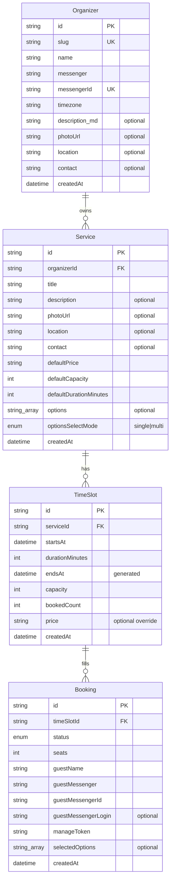

# Domain model

Core entities and invariants for CountMeIn booking. Architecture context: [architecture.md](architecture.md).

There is **no `Calendar` entity**. An organizer owns services directly; timezone lives on the organizer (one working timezone per organizer).

## Entities



Foreign keys on ER diagrams are the relationship lines (`organizerId`, `serviceId`, `timeSlotId`); they become real columns in Drizzle.

An organizer reaches their bookings **transitively** (`Organizer → Service → TimeSlot → Booking`); there is no direct `Booking.organizerId` column (invariant 5).

### Identifiers and public URLs

| Entity      | PK type                        | Exposed in URL?                         |
| ----------- | ------------------------------ | --------------------------------------- |
| `Organizer` | `uuid` (Auth.js user id)       | No — public page uses `slug`            |
| `Service`   | short `text` id (nanoid/cuid2) | Yes — clean, URL-friendly               |
| `TimeSlot`  | `uuid`                         | No — no public URL                      |
| `Booking`   | `uuid`                         | No — management page uses `manageToken` |

- Organizer as a provider: `https://countmein.group/{orgSlug}`.
- A specific service/event: `https://countmein.group/{orgSlug}/{serviceId}`.
- Booking management: `https://countmein.group/booking/{manageToken}` (ADR-009 chose the spelled-out
  segment over the shorter `/b/`).

`Organizer.id` stays `uuid` for frictionless Auth.js integration and is never shown; the human-friendly organizer address is `slug`. `Service.id` is a short random `text` id so it reads well in the URL (services have no slug). `TimeSlot`/`Booking` ids are internal `uuid`s.

### Organizer

The authenticated account itself (`id` is the sole primary key). Auth.js uses this id as the user subject — **no separate `userId`**. Login identity is the messenger account ([ADR-008](decisions/008-messenger-only-auth.md)) — **no phone column**.

Public page: `https://countmein.group/{slug}`.

| Field         | Required | Meaning                                                                                        |
| ------------- | -------- | ---------------------------------------------------------------------------------------------- |
| `id`          | yes      | PK; Auth.js user id                                                                            |
| `slug`        | yes      | Public URL segment                                                                             |
| `name`        | yes      | Display name                                                                                   |
| `messenger`   | yes      | Auth/notification channel (enum; `telegram` in MVP)                                            |
| `messengerId` | yes      | Stable user id in that messenger (e.g. Telegram user id); unique together with `messenger`     |
| `timezone`    | yes      | IANA tz (e.g. `Europe/Belgrade`); all slots interpreted in this zone                           |
| `description` | no       | Markdown (links allowed) for the public page                                                   |
| `photoUrl`    | no       | Avatar / cover image (object storage URL)                                                      |
| `location`    | no       | Display address shown on the public page; default location for the organizer's services        |
| `contact`     | no       | Display-only "how to reach me" — free text (phone / email / social link); default for services |
| `createdAt`   | yes      | Row creation timestamp (UTC)                                                                   |

MVP: one organizer account = one person. Multi-staff is post-MVP.

### Service

Bookable offering owned by an organizer (`organizerId`).

| Field                    | Required           | Meaning                                                                                  |
| ------------------------ | ------------------ | ---------------------------------------------------------------------------------------- |
| `organizerId`            | yes                | FK → Organizer                                                                           |
| `title`                  | yes                | Name                                                                                     |
| `description`            | no                 | Longer text                                                                              |
| `photoUrl`               | no                 | Service image                                                                            |
| `location`               | no                 | Display address for this service; overrides `Organizer.location` when set                |
| `contact`                | no                 | Display contact for this service; overrides `Organizer.contact` when set                 |
| `defaultPrice`           | yes                | **Display text** for value + currency (e.g. `1500 UAH`, `от 20€`) — not a payment amount |
| `defaultCapacity`        | yes                | Template for new slots (capacity)                                                        |
| `defaultDurationMinutes` | yes                | Template for new slots (length, minutes); `> 0`                                          |
| `options`                | no                 | Allowed variation labels (e.g. pickup points) as **plain strings** (stored `text[]`)     |
| `optionsSelectMode`      | when `options` set | `single` (pick one) or `multi` (pick several)                                            |
| `createdAt`              | yes                | Row creation timestamp (UTC)                                                             |

`options` are deliberately plain strings (not a separate entity with IDs) to keep the MVP simple. Because `Booking.selectedOptions` stores the chosen **string values** (not references), a booking keeps the exact label it was made with even if the organizer later edits or removes that option from the service. This is an intentional trade-off: no referential integrity, but immutable, self-contained booking records.

### Contact (display field)

`contact` is **one universal string** on both `Organizer` and `Service`; the effective value for a service is:

```
effectiveContact(service) = service.contact ?? organizer.contact ?? null
```

— the same fallback rule as `location`. It has **no auth or notification role**. At render time a pure function (`detectContactKind`) classifies the text as phone / email / URL / plain text, and the UI component wraps it in the matching link (`tel:` / `mailto:` / `https:`) or a plain span. Shown on the public organizer page, service page, and booking confirmation/management pages.

### TimeSlot

Concrete occurrence of a service (`serviceId`). Defined by a start instant and a length; the end is derived.

| Field             | Required | Meaning                                                                                                       |
| ----------------- | -------- | ------------------------------------------------------------------------------------------------------------- |
| `serviceId`       | yes      | FK → Service                                                                                                  |
| `startsAt`        | yes      | Start instant (`timestamptz`, UTC; displayed in the organizer's timezone)                                     |
| `durationMinutes` | yes      | Length in whole minutes; `> 0`. Seeded from `Service.defaultDurationMinutes` on creation                      |
| `endsAt`          | derived  | **Generated** column = `startsAt + durationMinutes` (stored, for range queries/sorting; not written directly) |
| `capacity`        | yes      | Max seats                                                                                                     |
| `bookedCount`     | yes      | Seats held by `confirmed` bookings                                                                            |
| `price`           | no       | Display-text override for this occurrence; if null, use `Service.defaultPrice`                                |
| `createdAt`       | yes      | Row creation timestamp (UTC)                                                                                  |

The interval convention is half-open `[startsAt, endsAt)`. `durationMinutes` is the source of truth (organizers think “start + length”); `endsAt` exists only as a derived, indexable column.

### Booking

Reservation on a slot (`timeSlotId`) by a guest (no visitor Auth.js account). The guest is identified by their messenger account, verified via the login widget at booking time ([ADR-002](decisions/002-guest-booking.md), [ADR-008](decisions/008-messenger-only-auth.md)).

| Field                 | Required | Meaning                                                                                                                                                         |
| --------------------- | -------- | --------------------------------------------------------------------------------------------------------------------------------------------------------------- |
| `timeSlotId`          | yes      | FK → TimeSlot                                                                                                                                                   |
| `seats`               | yes      | `>= 1`                                                                                                                                                          |
| `guestName`           | yes      | Display name                                                                                                                                                    |
| `guestMessenger`      | yes      | Messenger the guest authenticated with (enum; `telegram` in MVP); notification channel                                                                          |
| `guestMessengerId`    | yes      | Stable user id in that messenger; indexed together with `guestMessenger` for "my bookings" lookup                                                               |
| `guestMessengerLogin` | no       | Human-readable messenger handle (e.g. Telegram @username); nullable — not all accounts expose a public login                                                    |
| `manageToken`         | yes      | Opaque secret embedded in the messenger deep link to the booking management page; **stored hashed** at rest — _not yet: MVP stores it verbatim, see note below_ |
| `selectedOptions`     | no       | String values chosen from `Service.options` at booking time (stored by value as `text[]`; `null` when the service has no options — see Service)                 |
| `status`              | yes      | Lifecycle                                                                                                                                                       |
| `createdAt`           | yes      | Row creation timestamp (UTC)                                                                                                                                    |

Validation: every `selectedOptions` entry must be in the service’s `options`; count must respect `optionsSelectMode`.

**`manageToken` is not hashed yet.** It is generated server-side with 32 bytes of entropy
(`lib/server/db/booking.ts`) and stored verbatim, because the lookup is a direct match on
`bookings_manage_token_key` and the demo seed ships known plaintext tokens. Hashing it means
switching that lookup to a digest and rewriting the seeded rows in the same change — worth doing,
but it is a migration, not a one-line edit. Until then the token is treated as a
password-equivalent everywhere else: it never appears in a URL on cancel (it goes in the request
body), never in the organizer-facing `BookingRecord`, and `/booking/{manageToken}` is `noindex`.

## Booking statuses

| Status      | Meaning                                  |
| ----------- | ---------------------------------------- |
| `confirmed` | Active; counts toward `bookedCount`      |
| `cancelled` | Released; must not count toward capacity |

MVP flow: the guest authenticates with the messenger login widget **before** any booking row exists (short-lived ticket; no seat held); then one transaction claims the seats and inserts the `confirmed` booking (see invariant 2). **No `pending` status.**

**Cancel is in MVP.** The guest opens the booking management page (deep link from the messenger, or by re-authenticating with the same messenger account); the organizer can also cancel from the cabinet. Cancelling sets `cancelled` and decrements `bookedCount` in the same transaction.

## Invariants

1. **Capacity:** for every slot, sum of `seats` over `confirmed` bookings equals `bookedCount`, and `bookedCount <= capacity`.
2. **Atomic reserve:** seats are claimed with a **single conditional statement** — `UPDATE TimeSlot SET bookedCount = bookedCount + :seats WHERE id = :id AND bookedCount + :seats <= capacity RETURNING …` — inside the booking transaction. The `Booking` row is inserted only if that statement affected a row. Never read `bookedCount`, check it in application code, then write it back separately: that reopens the overbooking race under concurrent bookings.
3. **Public access:** visitors read/book only via organizer `slug`; no organizer dashboard APIs.
4. **Slot bounds:** `durationMinutes >= 1` (so `endsAt > startsAt`); `capacity >= 1`; `seats >= 1`.
5. **Ownership:** `Service.organizerId` → organizer; `TimeSlot.serviceId` → service; `Booking.timeSlotId` → slot; organizer sees bookings for their services.
6. **Options:** if service has `options`, booking’s `selectedOptions` must be a valid selection per `optionsSelectMode`; if no `options`, `selectedOptions` is `null`.
7. **Price:** informational display only in MVP — no checkout or payment state.
8. **Messenger identity:** `(messenger, messengerId)` is unique per organizer; guest messenger identity comes only from server-validated widget payloads, never from raw client input.

## Payments

Out of scope for MVP as processing. `defaultPrice` / slot `price` are human-readable labels for the public page and booking UI only.
