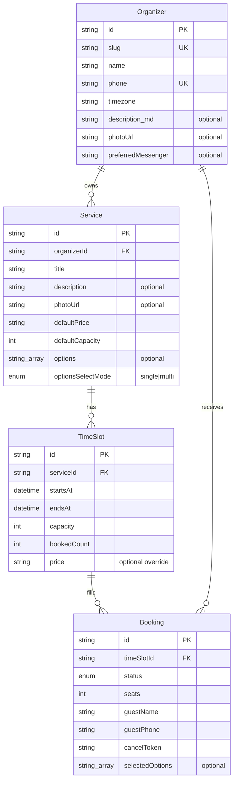

# Domain model

Core entities and invariants for CountMeIn booking. Architecture context: [architecture.md](architecture.md).

There is **no `Calendar` entity**. An organizer owns services directly; timezone lives on the organizer (one working timezone per organizer).

## Entities

Foreign keys on ER diagrams are the relationship lines (`organizerId`, `serviceId`, `timeSlotId`); they become real columns in Drizzle.

### Organizer

The authenticated account itself (`id` is the sole primary key). Auth.js uses this id as the user subject — **no separate `userId`**.

Public page: `https://countmein.group/{slug}`.

| Field | Required | Meaning |
|-------|----------|---------|
| `id` | yes | PK; Auth.js user id |
| `slug` | yes | Public URL segment |
| `name` | yes | Display name |
| `phone` | yes | E.164; login identity |
| `timezone` | yes | IANA tz (e.g. `Europe/Kyiv`); all slots interpreted in this zone |
| `description` | no | Markdown (links allowed) for the public page |
| `photoUrl` | no | Avatar / cover image (object storage URL) |
| `preferredMessenger` | no | Channel used for the last successful OTP (e.g. `telegram`); reuse for later OTP/notify |

MVP: one organizer account = one person. Multi-staff is post-MVP.

### Service

Bookable offering owned by an organizer (`organizerId`).

| Field | Required | Meaning |
|-------|----------|---------|
| `organizerId` | yes | FK → Organizer |
| `title` | yes | Name |
| `description` | no | Longer text |
| `photoUrl` | no | Service image |
| `defaultPrice` | yes | **Display text** for value + currency (e.g. `1500 UAH`, `от 20€`) — not a payment amount |
| `defaultCapacity` | yes | Template for new slots |
| `options` | no | Allowed variation labels (e.g. pickup points) as strings |
| `optionsSelectMode` | when `options` set | `single` (pick one) or `multi` (pick several) |

### TimeSlot

Concrete interval for a service (`serviceId`).

| Field | Required | Meaning |
|-------|----------|---------|
| `serviceId` | yes | FK → Service |
| `startsAt` / `endsAt` | yes | Bounds; convention fixed in schema (prefer half-open `[start, end)`) |
| `capacity` | yes | Max seats |
| `bookedCount` | yes | Seats held by `confirmed` bookings |
| `price` | no | Display-text override for this occurrence; if null, use `Service.defaultPrice` |

### Booking

Reservation on a slot (`timeSlotId`) by a guest (no visitor Auth.js account).

| Field | Required | Meaning |
|-------|----------|---------|
| `timeSlotId` | yes | FK → TimeSlot |
| `seats` | yes | `>= 1` |
| `guestName` | yes | Display name |
| `guestPhone` | yes | E.164; OTP target |
| `cancelToken` | yes | Secret for guest self-cancel |
| `selectedOptions` | no | Subset of `Service.options` chosen at booking time |
| `status` | yes | Lifecycle |

Validation: every `selectedOptions` entry must be in the service’s `options`; count must respect `optionsSelectMode`.

## Booking statuses

| Status | Meaning |
|--------|---------|
| `confirmed` | Active; counts toward `bookedCount` |
| `cancelled` | Released; must not count toward capacity |

MVP flow: messenger OTP verifies the phone **before** any booking row exists; then one transaction inserts `confirmed` and increments `bookedCount`. **No `pending` status.**

**Cancel is in MVP** (guest token or organizer): set `cancelled` and decrement `bookedCount` in the same transaction.

## Invariants

1. **Capacity:** for every slot, sum of `seats` over `confirmed` bookings equals `bookedCount`, and `bookedCount <= capacity`.
2. **Atomic reserve:** create booking only if `bookedCount + seats <= capacity`, in one transaction.
3. **Public access:** visitors read/book only via organizer `slug`; no organizer dashboard APIs.
4. **Slot bounds:** `startsAt < endsAt`; `capacity >= 1`; `seats >= 1`.
5. **Ownership:** `Service.organizerId` → organizer; `TimeSlot.serviceId` → service; `Booking.timeSlotId` → slot; organizer sees bookings for their services.
6. **Options:** if service has `options`, booking’s `selectedOptions` must be a valid selection per `optionsSelectMode`; if no `options`, `selectedOptions` is empty/null.
7. **Price:** informational display only in MVP — no checkout or payment state.

## Payments

Out of scope for MVP as processing. `defaultPrice` / slot `price` are human-readable labels for the public page and booking UI only.
