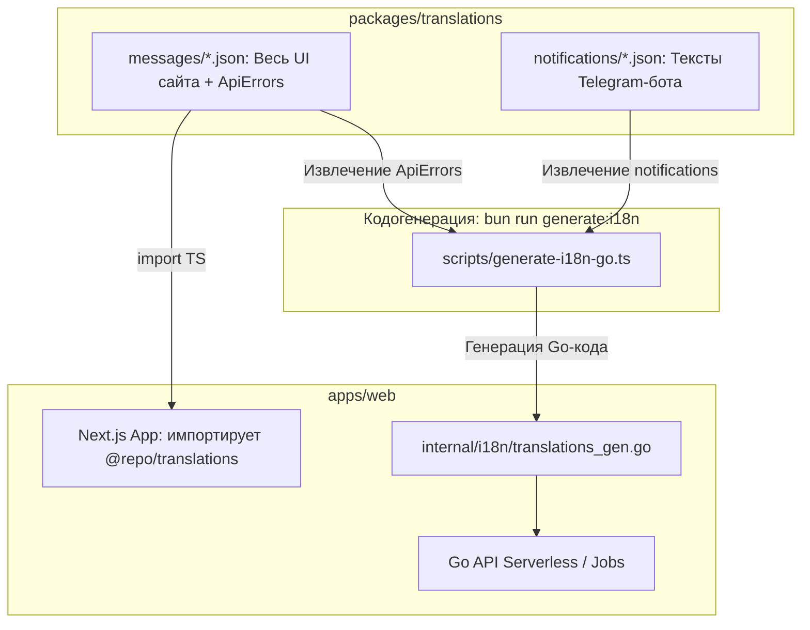

# План реализации: Кодогенерация Go-словарей переводов из `packages/translations`

В данном документе описан пошаговый план устранения дублирования файлов локализации между `packages/translations` и `apps/web/pkg/i18n/translations`.

---

## 1. Контекст и мотивация

### Текущее состояние (Проблема)
- В Git хранятся **16 дублирующихся JSON-файлов** (8 языков для `messages/` и 8 для `notifications/`) в двух местах:
  1. `packages/translations/{messages,notifications}/*.json`
  2. `apps/web/pkg/i18n/translations/{messages,notifications}/*.json`
- Директива Go `//go:embed` не может выходить за пределы своего каталога (`..`), поэтому файлы синхронизируются вручную скриптом `sync-translations.sh` и проверяются в CI через `check-translations.sh`.
- При этом:
  - Go API из всех файлов `messages/*.json` использует **только маленькую секцию `ApiErrors`** (все остальные сотни строк интерфейса сайта парсятся вхолостую).
  - Next.js файлы `notifications/*.json` **не использует вообще**.
  - При холодном старте Go API тратит процессорное время и память на `json.Unmarshal` 16 файлов.

### Целевое состояние (Решение)
- `packages/translations` остается **единственным источником правды** для всех локализаций в репозитории.
- Каталог `apps/web/pkg/i18n/translations/` со всеми 16 JSON-файлами **полностью удаляется из репозитория**.
- Скрипты `sync-translations.sh` и `check-translations.sh` удаляются.
- Скрипт кодогенерации `apps/web/scripts/generate-i18n-go.ts` читает `packages/translations` и генерирует один Go-файл: `apps/web/pkg/i18n/translations_gen.go`.
- Все тексты компилируются непосредственно в структуры Go (`map[string]...`), исключая рантайм-парсинг JSON.



---

## 2. Пошаговые шаги реализации

### Шаг 1. Создание скрипта кодогенерации `apps/web/scripts/generate-i18n-go.ts`

Скрипт читает JSON-файлы из `packages/translations`, извлекает нужные секции и формирует валидный Go-файл с вызовом `gofmt`.

**Файл:** `apps/web/scripts/generate-i18n-go.ts`

```typescript
import { execSync } from 'node:child_process'
import { readdirSync, readFileSync, writeFileSync } from 'node:fs'
import { join } from 'node:path'
import { fileURLToPath } from 'node:url'

const __dirname = fileURLToPath(new URL('.', import.meta.url))
const rootDir = join(__dirname, '..', '..', '..')
const translationsDir = join(rootDir, 'packages', 'translations')
const messagesDir = join(translationsDir, 'messages')
const notificationsDir = join(translationsDir, 'notifications')
const targetFile = join(__dirname, '..', 'internal', 'i18n', 'translations_gen.go')

function escapeGo(str: string): string {
  return JSON.stringify(str)
}

function generate(): void {
  const locales = readdirSync(messagesDir)
    .filter((f) => f.endsWith('.json'))
    .map((f) => f.replace('.json', ''))
    .sort()

  const apiErrorsByLocale: Record<string, Record<string, string>> = {}
  const notificationsByLocale: Record<
    string,
    { top: Record<string, string>; sections: Record<string, Record<string, string>> }
  > = {}

  for (const locale of locales) {
    // 1. Извлекаем только ApiErrors из messages
    const msgPath = join(messagesDir, `${locale}.json`)
    const msgContent = JSON.parse(readFileSync(msgPath, 'utf8'))
    const apiErrors = msgContent.ApiErrors || {}
    apiErrorsByLocale[locale] = {}
    for (const [key, val] of Object.entries(apiErrors)) {
      if (typeof val === 'string') {
        apiErrorsByLocale[locale][key] = val
      }
    }

    // 2. Извлекаем notifications
    const notifPath = join(notificationsDir, `${locale}.json`)
    const notifContent = JSON.parse(readFileSync(notifPath, 'utf8'))
    const dict = {
      top: {} as Record<string, string>,
      sections: {} as Record<string, Record<string, string>>,
    }

    for (const [section, val] of Object.entries(notifContent)) {
      if (typeof val === 'string') {
        dict.top[section] = val
      } else if (typeof val === 'object' && val !== null) {
        dict.sections[section] = {}
        for (const [k, s] of Object.entries(val as Record<string, unknown>)) {
          if (typeof s === 'string') {
            dict.sections[section][k] = s
          }
        }
      }
    }
    notificationsByLocale[locale] = dict
  }

  // Генерация исходного кода Go
  let code = `// Code generated by scripts/generate-i18n-go.ts; DO NOT EDIT.
package i18n

func init() {
\tapiErrors = genAPIErrors
\tnotifications = genNotifications
}

var genAPIErrors = map[string]map[string]string{
`

  for (const locale of locales) {
    code += `\t${escapeGo(locale)}: {\n`
    const keys = Object.keys(apiErrorsByLocale[locale]).sort()
    for (const k of keys) {
      code += `\t\t${escapeGo(k)}: ${escapeGo(apiErrorsByLocale[locale][k])},\n`
    }
    code += `\t},\n`
  }
  code += `}\n\n`

  code += `var genNotifications = map[string]notifDict{\n`
  for (const locale of locales) {
    const dict = notificationsByLocale[locale]
    code += `\t${escapeGo(locale)}: {\n`
    code += `\t\ttop: map[string]string{\n`
    for (const k of Object.keys(dict.top).sort()) {
      code += `\t\t\t${escapeGo(k)}: ${escapeGo(dict.top[k])},\n`
    }
    code += `\t\t},\n`
    code += `\t\tsections: map[string]map[string]string{\n`
    for (const sec of Object.keys(dict.sections).sort()) {
      code += `\t\t\t${escapeGo(sec)}: {\n`
      for (const k of Object.keys(dict.sections[sec]).sort()) {
        code += `\t\t\t\t${escapeGo(k)}: ${escapeGo(dict.sections[sec][k])},\n`
      }
      code += `\t\t\t},\n`
    }
    code += `\t\t},\n`
    code += `\t},\n`
  }
  code += `}\n`

  writeFileSync(targetFile, code, 'utf8')
  try {
    execSync(`gofmt -w "${targetFile}"`, { stdio: 'inherit' })
  } catch {
    // Если gofmt недоступен в текущем окружении, оставляем файл как есть
  }
  console.log(`Generated Go translations at ${targetFile}`)
}

generate()
```

---

### Шаг 2. Обновление `apps/web/pkg/i18n/loader.go`

Из файла удаляются директивы `//go:embed`, вызовы `json.Unmarshal` и работа с файловой системой. Переменные инициализируются напрямую сгенерированными мапами.

**Файл:** `apps/web/pkg/i18n/loader.go`

```go
package i18n

import (
	"countmein/pkg/contracts"
)

// notifDict — notification copy is two shapes: top-level messages
// ("seats") and per-audience sections ("createdOrganizer" → title…).
type notifDict struct {
	top      map[string]string
	sections map[string]map[string]string
}

var (
	// locale → key → message (the ApiErrors section).
	apiErrors = map[string]map[string]string{}
	// locale → notification copy.
	notifications = map[string]notifDict{}
)

// apiError renders a localized API error (the ApiErrors section),
// falling back to English, then to the key itself.
func ApiError(locale, key string, params map[string]any) string {
	msg, ok := apiErrors[locale][key]
	if !ok {
		msg, ok = apiErrors[contracts.DefaultLocale][key]
		if !ok {
			return key
		}
		locale = contracts.DefaultLocale
	}
	return Format(msg, locale, params)
}

// Notif renders a notification message. section "" addresses the
// top-level keys ("seats"); otherwise section.key. Falls back to
// English, then to "section.key".
func Notif(locale, section, key string, params map[string]any) string {
	lookup := func(loc string) (string, bool) {
		d, ok := notifications[loc]
		if !ok {
			return "", false
		}
		if section == "" {
			msg, found := d.top[key]
			return msg, found
		}
		msg, found := d.sections[section][key]
		return msg, found
	}
	msg, ok := lookup(locale)
	if !ok {
		msg, ok = lookup(contracts.DefaultLocale)
		if !ok {
			if section == "" {
				return key
			}
			return section + "." + key
		}
		locale = contracts.DefaultLocale
	}
	return Format(msg, locale, params)
}
```

---

### Шаг 3. Удаление дублирующихся JSON и старых скриптов

1. Удалить каталог дубликатов:
   ```sh
   rm -rf apps/web/pkg/i18n/translations
   ```
2. Удалить скрипты ручной синхронизации и проверки дрифта:
   ```sh
   rm apps/web/scripts/go/sync-translations.sh
   rm apps/web/scripts/go/check-translations.sh
   ```

---

### Шаг 4. Обновление сборочного скрипта `apps/web/scripts/go/build.sh`

Убрать строку `sh scripts/check-translations.sh` из скрипта сборки Go.

**Было в `apps/web/scripts/go/build.sh`:**
```sh
sh scripts/check-translations.sh
```
**Стало:**
Строка удалена, так как проверка дрифта больше не требуется (файл генерируется детерминированно из источника).

---

### Шаг 5. Интеграция в `package.json`, `turbo.json` и CI

1. **В `apps/web/package.json`:**
   Добавить скрипт генерации:
   ```json
   "scripts": {
     "generate:i18n": "bun scripts/generate-i18n-go.ts",
     "build:go": "bun run generate:i18n && sh scripts/go/build.sh",
     ...
   }
   ```

2. **В `packages/translations/package.json`:**
   Заменить `"sync:go"` на вызов генератора:
   ```json
   "scripts": {
     "generate:go": "bun run ../../apps/web/scripts/generate-i18n-go.ts",
     ...
   }
   ```

3. **В корневой `package.json`:**
   Добавить шорткат:
   ```json
   "generate:i18n": "turbo run generate:i18n"
   ```

4. **В `turbo.json`:**
   Описать зависимость генератора, чтобы Turbo кэшировал результат:
   ```json
   "tasks": {
     "generate:i18n": {
       "inputs": ["packages/translations/**/*.json"],
       "outputs": ["apps/web/pkg/i18n/translations_gen.go"]
     },
     "build": {
       "dependsOn": ["^build", "generate:i18n"],
       ...
     }
   }
   ```

5. **В `.github/workflows/ci.yml`:**
   В задаче `go-api` перед сборкой запускать генерацию:
   ```yaml
   - name: Generate Go translations
     run: bun run apps/web/scripts/generate-i18n-go.ts

   - name: Check for uncommitted generated changes
     run: git diff --exit-code apps/web/pkg/i18n/translations_gen.go
   ```
   *Это гарантирует, что если разработчик изменил текст в JSON, он не забыл перегенерировать файл перед коммитом.*

---

## 3. Верификация и тестирование

После выполнения шагов запускается полный набор проверок:

```sh
# 1. Запустить генератор
bun run apps/web/scripts/generate-i18n-go.ts

# 2. Проверить компиляцию и тесты Go i18n
cd apps/web && go test -v ./pkg/i18n/...

# 3. Запустить полный билд Go
sh apps/web/scripts/go/build.sh

# 4. Проверить линтер и тесты монорепозитория
bun run lint
bun run test
bun run build
```

---

## 4. Результаты изменений

1. **-16 JSON-файлов из Git:** `internal/i18n/translations/` полностью удален.
2. **Единый источник правды:** Разработчик или переводчик редактирует файлы только в `packages/translations/`.
3. **Нулевой runtime оверхед:** Go больше не разбирает JSON через рефлексию при старте, структуры встроены как нативный байткод.
4. **Удаление лишних данных:** В Go-бинарник попадают только тексты уведомлений и ошибки API; сотни строк UI сайта больше не попадают в Go API.
5. **CI-надежность:** Проверка `git diff --exit-code` в CI страхует от рассинхронизации коммитов.
